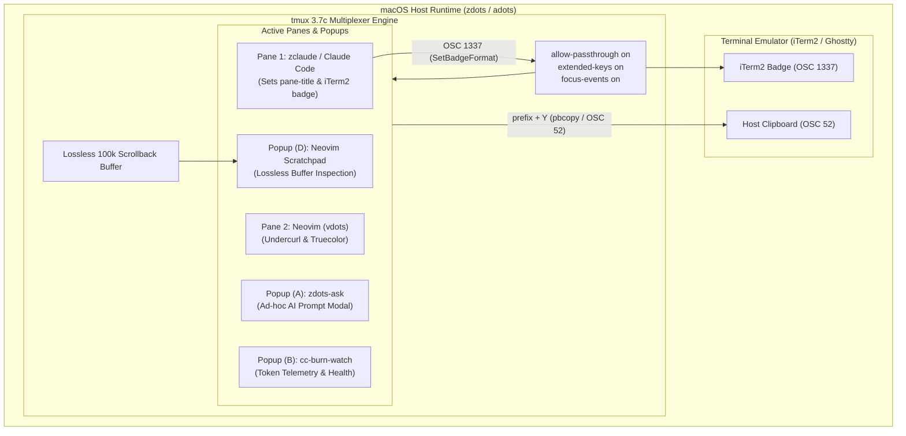

# tmux Configuration — Kanagawa Wave & AI-Agent Architecture

High-signal, low-friction `tmux` configuration for Mike Hall's personal OS (**zdots** / **adots**), tuned for deep terminal fidelity, human ergonomics, and seamless orchestration with autonomous AI agents (Claude Code, `zclaude`, Antigravity, local LLMs).

* **Canonical Location**: `~/.config/tmux/tmux.conf` (tracked via `adots`)
* **Theme Origin**: Rebelot's [Kanagawa](https://github.com/rebelot/kanagawa.nvim) (`wave` variant) harmonized with `~/.config/zsh/etc/themes/kanagawa-wave.yaml`
* **Architectural Rule**: **Stateless by design** — strictly NO session-resurrection plugins (`resurrect`/`continuum`).

---

## 1. Visual Architecture & Anatomy

### Status Bar Anatomy (Harmonized with Powerlevel10k)

The status bar employs the exact round capsule aesthetic (`` `\uE0B6`, `` `\uE0B4`) defined in Mike's `~/.config/zsh/.p10k.zsh` (`p10k-rainbow` round heads and tails), mapped against the canonical Kanagawa Wave palette:

```text
 ┌── Status Left (Round Capsules) ──────────────────────────────────────┐  ┌── Inactive Window ─────────┐  ┌── Active Window (p10k 2-tone) ─┐
 │ 󰌌 dev  󰘳 PREFIX  󰆏 COPY  󰓦 SYNC ⚠️                               │  │  1 zsh                   │  │  2  zclaude 󰍉             │
 └─[crystalBlue]───[surimiOrange]──[springGreen]──[autumnRed]───────────┘  └─[sumiInk4]──[oldWhite]─────┘  └─[carpYellow]──[waveBlue2]──────┘

                                                                             ┌── Status Right (p10k Segmented Round Capsule) ─────────────┐
                                                                             │ 󰆍 nvim 󰸗 2026-09-06 󰥔 21:00                            │
                                                                             └─[sumiInk4]──[waveBlue1]──[oniViolet]───────────────────────┘
```

* **Session Capsule** (`#7E9CD8` `crystalBlue` on `#16161D` `sumiInk0`): Identifies the active session.
* **Dynamic Mode Badges**:
  * `󰘳 PREFIX` (`#FFA066` `surimiOrange`): Illuminates immediately when `C-a` prefix is pending.
  * `󰆏 COPY` (`#98BB6C` `springGreen`): Visible while traversing buffer history or selecting text in copy mode.
  * `󰓦 SYNC ⚠️` (`#C34043` `autumnRed`): High-visibility warning displayed whenever `synchronize-panes` is toggled ON.
* **Window Tabs**:
  * **Inactive**: Subtle `#2A2A37` `sumiInk4` pill with `#727169` `fujiGray` index and `#C8C093` `oldWhite` title (contrast compliant).
  * **Active**: `#E6C384` `carpYellow` index pill connected to a `#2D4F67` `waveBlue2` body displaying `#DCD7BA` `fujiWhite` title and `󰍉` zoom badge.
* **Telemetry & Context**:
  * **Command Pill**: `#7AA89F` `waveAqua2` displaying `#{pane_current_command}`.
  * **Date Capsule**: `#6A9589` `waveAqua1` on `#223249` `waveBlue1`.
  * **Time Capsule**: Bold `#16161D` `sumiInk0` on `#957FB8` `oniViolet`.

> [!TIP]
> **Format Conditional Hygiene**: In tmux format strings, `#{?cond,true,false}` delimits branches by commas. Style blocks inside conditional branches use separate attribute blocks (e.g. `#[fg=X]#[bg=Y]#[bold]`) without internal commas, preventing branch corruption and ensuring clean rendering.

---

### Pane Border Header (`pane-border-status top`)

Each pane displays an informative top banner, keeping agent context, process names, and working paths continuously visible:

```text
 ┌── [1] zclaude:interactive/sonnet │ zdots 󰍉 ZOOMED ──────────────────────────────────────────┐
 │                                                                                             │
 │                                                                                             │
 └─────────────────────────────────────────────────────────────────────────────────────────────┘
```

* **Pane Index** (`#727169` `fujiGray`): Explicit numeric index for rapid CLI targeting (`tmux select-pane -t 1`).
* **Dynamic Title** (`#957FB8` `oniViolet` bold): Displays `#{pane_title}` when set (e.g. `zclaude` automatically publishes `zclaude:mode/model` via `select-pane -T`), falling back to `#{pane_current_command}`.
* **Directory Basename** (`#7AA89F` `waveAqua2`): Current working directory basename (`#{b:pane_current_path}`).
* **Zoom Alert** (`#FFA066` `surimiOrange` bold): Unmistakable `󰍉 ZOOMED` banner when a pane occupies the full window.
* **Border Lines**: Active pane glow in `#957FB8` `oniViolet`; inactive dividers in subtle `#363646` `sumiInk5`.

---

## 2. Kanagawa Wave Palette Reference

Strict adherence to the canonical palette defined in [`etc/themes/kanagawa-wave.yaml`](file:///Users/mike/.config/zsh/etc/themes/kanagawa-wave.yaml):

| Token | Hex Literal | Swatch | Visual Role & tmux Element |
|---|---|---|---|
| `sumiInk0` | `#16161D` | `████` | Deepest contrast background; badge text on light pills |
| `sumiInk3` | `#1A1B2F` | `████` | Platform ground; status bar background, modal window background |
| `sumiInk4` | `#2A2A37` | `████` | Raised surface; inactive window pills, status command capsule |
| `sumiInk5` | `#363646` | `████` | Subtle border; inactive pane borders and dividers |
| `sumiInk6` | `#54546D` | `████` | Hairlines; sub-segment dividers (`│`, ``) |
| `waveBlue1` | `#223249` | `████` | Intermediate panel tone; date capsule background |
| `waveBlue2` | `#2D4F67` | `████` | Selection; active window body, copy-mode text selection highlight |
| `fujiWhite` | `#DCD7BA` | `████` | Primary text; active window label, default foreground |
| `fujiGray` | `#727169` | `████` | Muted elements; inactive pane indices, inactive window numbers |
| `oldWhite` | `#C8C093` | `████` | AA-safe readable text; inactive window title labels |
| `crystalBlue`| `#7E9CD8` | `████` | The Great Wave accent; session badge, floating popup borders |
| `springBlue` | `#7FB4CA` | `████` | Bright wave blue; link accents and active indicators |
| `waveAqua1` | `#6A9589` | `████` | Calm cyan; status date indicator, informational messages |
| `waveAqua2` | `#7AA89F` | `████` | Bright cyan; command titles, message bar foreground |
| `springGreen`| `#98BB6C` | `████` | Success; copy mode active badge (`󰆏 COPY`) |
| `autumnGreen`| `#76946A` | `████` | ANSI green; secondary status accents |
| `carpYellow` | `#E6C384` | `████` | Carp yellow; active window index pill (`#I`), warning states |
| `boatYellow2`| `#C0A36E` | `████` | Warm gold; operator highlights |
| `surimiOrange`| `#FFA066`| `████` | Surimi orange; prefix active badge (`󰘳 PREFIX`), zoom alert |
| `oniViolet` | `#957FB8` | `████` | Oni violet; active pane border glow, agent title, clock pill |
| `autumnRed` | `#C34043` | `████` | Error / Alert; sync-panes loud warning (`󰓦 SYNC ⚠️`) |

---

## 3. Architecture: AI Agent & Multiplexer Orchestration



### Key Agent Integration Protocols

1. **OSC Escape Passthrough (`allow-passthrough on`)**:
   * Enables child processes to emit control sequences through tmux to the terminal emulator.
   * `zclaude` interactive sessions use this to encode and pass the active model badge (`\ePtmux;\e\e]1337;SetBadgeFormat=...\a\e\\`) directly to iTerm2.
   * Allows desktop notification codes (`OSC 9` / `OSC 777`) and inline graphic protocols (Kitty, iTerm).

2. **Extended Keys Protocol (`extended-keys on` & `terminal-features ",*:extkeys"`)**:
   * Implements the CSI u / kitty keyboard protocol.
   * Key combinations like `Shift+Enter` (used by modern agent TUIs to insert a newline instead of submitting) pass cleanly without being mapped to standard carriage return.

3. **Lossless Context Scraping**:
   * Traditional screen captures wrap lines at terminal boundaries, injecting spurious linebreaks that corrupt code blocks when ingested by an LLM.
   * `bind Y` executes `capture-pane -p -J -S - | pbcopy`:
     * `-p`: Emits directly to standard output.
     * `-J`: Preserves trailing spaces and joins wrapped lines losslessly.
     * `-S -`: Pulls from the start of the 100,000-line history buffer.

4. **Floating Neovim Scratchpad Inspector (`bind D`)**:
   * Dumps the entire active scrollback buffer and feeds it via stdin to Neovim in an ephemeral scratch popup (`buftype=nofile bufhidden=wipe ft=log`).
   * Gives instant access to Neovim search (`/`), treesitter/log syntax highlighting, quickfix jumping, and telescope.

---

## 4. Keybinding Reference

Prefix: **`Ctrl-a`** (consistent with Emacs and ergonomic workflows).

### AI Agent Orchestration & Buffers
| Key Binding | Command / Action | Purpose |
|---|---|---|
| `prefix + Y` | `capture-pane -p -J -S - \| pbcopy` | **Lossless Buffer Copy**: dumps entire history to clipboard |
| `prefix + M-y` | `capture-pane -p -J -S -500 \| pbcopy` | **Tail Buffer Copy**: copies the last 500 lines to clipboard |
| `prefix + D` | `display-popup ... nvim` | **Buffer Inspector**: opens pane history in floating Neovim modal |
| `prefix + C` | `new-window ... 'zclaude'` | **Interactive zclaude**: opens platform maintenance session |
| `prefix + P` | `display-popup ... 'zclaude --sync'` | **Platform Sync**: opens 4-repo review popup |
| `prefix + A` | `display-popup ... 'zdots-ask'` | **Ask Agent**: floating ad-hoc LLM query modal in current directory |
| `prefix + B` | `display-popup ... 'cc-burn-watch'` | **Token Burn / Telemetry**: token usage & collector health popup |

### Navigation & Resizing
| Key Binding | Command / Action | Purpose |
|---|---|---|
| `prefix + h` | `select-pane -L` | Select left pane |
| `prefix + j` | `select-pane -D` | Select bottom pane |
| `prefix + k` | `select-pane -U` | Select top pane |
| `prefix + l` | `select-pane -R` | Select right pane |
| `prefix + H` | `resize-pane -L 5` | Resize pane left (repeatable) |
| `prefix + J` | `resize-pane -D 5` | Resize pane down (repeatable) |
| `prefix + K` | `resize-pane -U 5` | Resize pane up (repeatable) |
| `prefix + L` | `resize-pane -R 5` | Resize pane right (repeatable) |

### Windows, Splits & Safety
| Key Binding | Command / Action | Purpose |
|---|---|---|
| `prefix + c` | `new-window -c "#{pane_current_path}"` | Create window (preserves current working directory) |
| `prefix + \|` or `%` | `split-window -h -c "#{pane_current_path}"`| Split horizontally (preserves directory) |
| `prefix + -` or `"` | `split-window -v -c "#{pane_current_path}"`| Split vertically (preserves directory) |
| `prefix + z` | `resize-pane -Z` | Toggle pane zoom (visual `󰍉` indicator active) |
| `prefix + S` | `setw synchronize-panes` | Toggle sync-panes (triggers loud `󰓦 SYNC ⚠️` banner) |
| `prefix + R` | `source-file .../tmux.conf` | Reload configuration instantly with feedback |

### Plugins (Stateless TPM Suite)
| Key Binding | Plugin | Purpose |
|---|---|---|
| `prefix + Tab` | `laktak/extrakto` | Fuzzy-extract file paths, hashes, URLs, or tokens using fzf |
| `prefix + F` | `sainnhe/tmux-fzf` | Fuzzy switch sessions, windows, panes, and run commands |
| `copy-mode + y`| `tmux-plugins/tmux-yank` | Copy selection to system clipboard (copy-pipe) |
| `copy-mode + o`| `tmux-plugins/tmux-open` | Open selected file or URL in default application |
| `copy-mode + C-o`| `tmux-plugins/tmux-open` | Open selected file in `$EDITOR` |

---

## 5. Operations & Verification

### Syntax Validation
Test configuration changes in a clean, isolated socket without interfering with active sessions:
```bash
tmux -L test-check -f ~/.config/tmux/tmux.conf start-server \; kill-server
```

### Live Reloading
Within any active tmux session:
```bash
prefix + R
```
Displays `✓ tmux.conf reloaded (Kanagawa Wave active)` in the command bar.

### Secret Scanning
Verify zero credentials or sensitive variables exist before committing dotfiles:
```bash
~/.config/zsh/bin/secret-scan ~/.config/tmux/tmux.conf ~/.config/tmux/README.md
```
